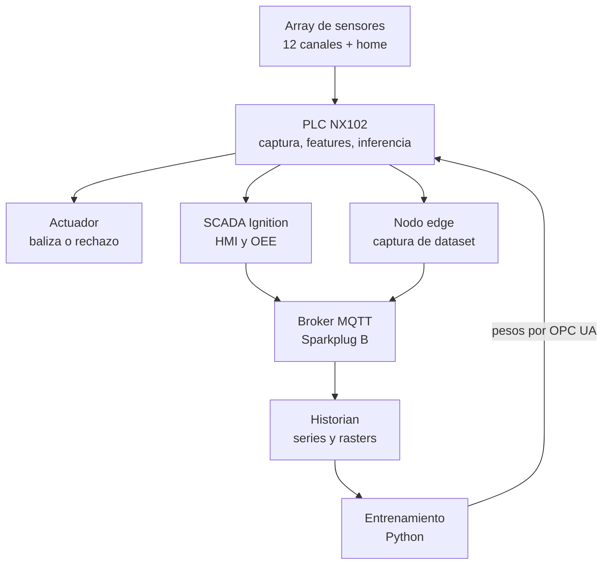
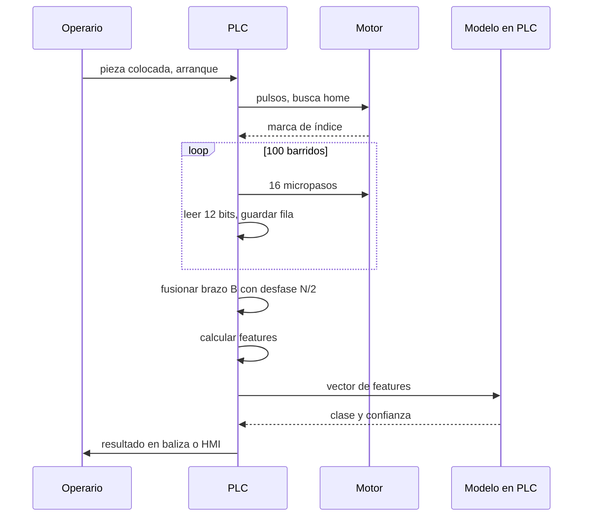
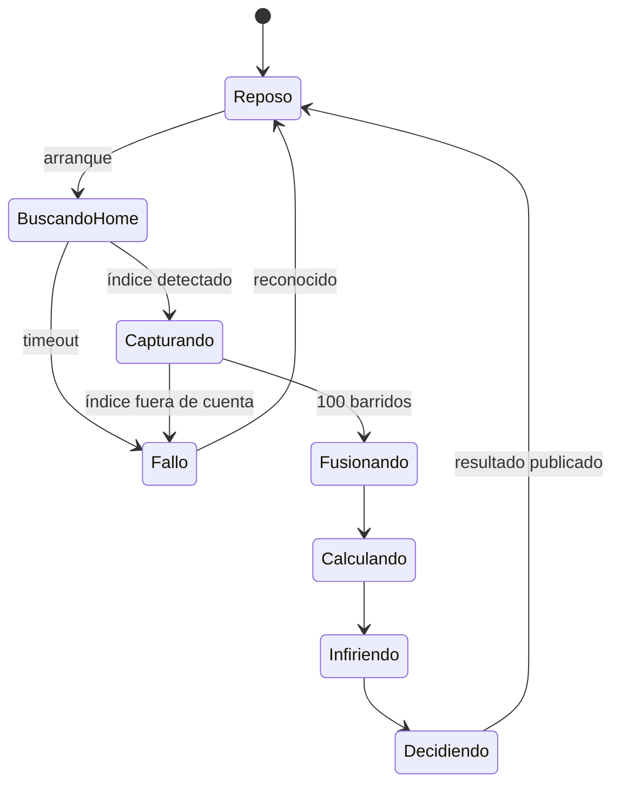
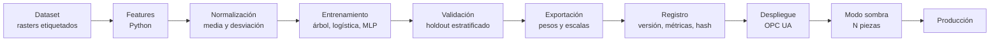
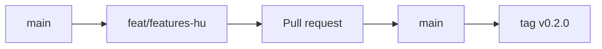

# Proyecto Girasol — Brief de arranque

> **Documento de contexto maestro.** Pegar completo en Kilo Code como primer mensaje
> del proyecto, o guardarlo en `docs/00-brief.md` y referenciarlo desde las reglas.
> Todo lo que un agente necesita saber para trabajar en este repo está aquí.

---

## 0. Instrucciones para el agente

Eres un agente de desarrollo trabajando en el proyecto **Girasol**. Antes de escribir
una sola línea de código:

1. Lee este documento completo.
2. Crea la estructura de carpetas de la sección 6, con los archivos placeholder.
3. Inicializa el repositorio git según la sección 8.
4. Genera los documentos de `docs/` según la sección 10.
5. Abre los issues de la sección 11.

**Reglas que no se negocian:**

- Nada de código sin su test. Las features geométricas se validan contra vectores
  dorados antes de portarse a ST.
- Cualquier cálculo implementado dos veces (Python y ST) debe producir resultados
  idénticos dentro de una tolerancia declarada. Eso se verifica automáticamente.
- Los datasets no entran al repositorio. Solo su esquema y su checksum.
- Cada decisión de arquitectura no obvia se registra como ADR.
- La documentación se escribe en español. El `README.md` raíz va en inglés
  (el repo es portafolio para el mercado de Toronto).
- Commits en formato Conventional Commits. Sin excepciones.

---

## 1. Qué es Girasol

Un sistema de **visión industrial sin cámara**. Una mesa giratoria pasa una pieza bajo
una fila de sensores fotoeléctricos discretos. El PLC acumula las lecturas binarias en
una matriz que representa la silueta de la pieza, calcula descriptores geométricos, y
ejecuta un clasificador de machine learning **dentro del propio PLC** para decidir qué
pieza es y si está bien orientada.

Los pesos del modelo se entrenan en Python y se despliegan al PLC por OPC UA, con
validación en sombra antes de que el modelo nuevo tome control.

### Por qué existe

No es un proyecto de detección de piezas. Es una demostración de cinco competencias:

| Competencia | Dónde se ve |
| --- | --- |
| Programación de PLC estructurada | Captura sincrónica, buffer circular, máquina de estados, generación de pulsos |
| Algoritmos implementados a mano | Momentos de imagen en ST, sin librerías |
| Machine learning por dentro | Inferencia reimplementada en ST: producto matriz-vector, activación, argmax |
| Uso no convencional del PLC | Inferencia de ML en tiempo de ciclo, sin PC, sin nube, sin cámara |
| MLOps aterrizado a planta | Capturar, entrenar, versionar, desplegar por OPC UA, validar en sombra |

### Lo que NO es

- No es un sistema de seguridad. Ningún sensor es componente de seguridad.
- No pretende competir con una cámara industrial en resolución.
- No usa deep learning pesado. El modelo cabe en un PLC a propósito.

---

## 2. Glosario

| Término | Definición |
| --- | --- |
| **Barrido** / fila | Una lectura simultánea de los M canales en un instante. Vector de M bits. |
| **Raster** | Matriz de N barridos × M canales acumulada durante una vuelta completa. |
| **Canal** | Un sensor. Numerados de 0 (radio menor) a M−1 (radio mayor). |
| **Brazo A / brazo B** | Las dos mitades de la viga diametral. A lleva canales pares, B impares. |
| **Índice / home** | Sensor dedicado que lee una marca en el canto del plato, una vez por vuelta. |
| **Feature** | Descriptor numérico calculado sobre el raster (área, centroide, momento…). |
| **Vector dorado** | Par (raster de entrada, salida esperada) usado para validar ST contra Python. |
| **Modo sombra** | El modelo nuevo infiere en paralelo sin actuar, solo para comparar. |
| **BGS** | Background suppression. Supresión de fondo por triangulación. |

---

## 3. Hardware

| Elemento | Especificación | Cantidad |
| --- | --- | --- |
| Sensor fotoeléctrico | Balluff BOS ...-PU-RH10-S75, difuso con BGS, PNP NO/NC, M8 4 pines, 10–30 VDC | 17 disponibles |
| Canales radiales | 12 en uso (6 por brazo) | 12 |
| Índice de home | 1 sensor al canto del plato | 1 |
| Reserva | Sin montar | 4 |
| PLC principal | Omron NX102-9000 | 1 |
| Entradas digitales | 2 × NX-ID5442 (32 puntos) | 2 |
| Salidas digitales | NX-OD5256 | 1 |
| PLC secundario (portabilidad) | Allen-Bradley CompactLogix L33ER | 1 |
| Motor | NEMA 17 | 1 |
| Driver | TB6600, entradas de 24 V, cátodo común | 1 |
| Fuente | 24 VDC, 3 A mínimo | 1 |
| Cordsets | M8 hembra 4 pines | 13 |

### Geometría del array

- Viga diametral recta apoyada en dos postes (pórtico, no voladizo).
- Brazo A, radios: 30, 50, 70, 90, 110, 130 mm.
- Brazo B, radios: 40, 60, 80, 100, 120, 140 mm.
- Paso entre vecinos del mismo brazo: 20 mm.
- Resolución radial combinada: 10 mm.
- Desfase angular entre brazos: 180°, es decir N/2 barridos exactos.
- Orientación del cuerpo: eje largo (43 mm) **tangencial**, eje corto (11 mm) radial.
- Distancia de trabajo: 50–80 mm entre la cara óptica y el plato.
- El radio se mide desde el eje de giro hasta el punto de luz, en horizontal.

### Parámetros de movimiento

| Parámetro | Valor | Símbolo |
| --- | --- | --- |
| Micropasos por vuelta | 1600 (1/8 de paso, 200 pasos/vuelta) | $S$ |
| Micropasos por barrido | 16 | $s$ |
| Barridos por vuelta | 100 | $N$ |
| Resolución angular | 3.6° | $\Delta\theta$ |
| Período de pulso | 2 ms | $T_p$ |
| Duración de vuelta | 3.2 s | $T_{rev}$ |
| Canales | 12 | $M$ |

---

## 4. Arquitectura

### 4.1 Capas del sistema



La decisión rápida nunca sale del PLC. Si el enlace al edge se cae, la máquina sigue
clasificando y actuando. Esa es la regla de diseño que separa este proyecto de una
demo de escritorio.

### 4.2 Ciclo de una pieza



### 4.3 Máquina de estados del ciclo



### 4.4 Pipeline del modelo



---

## 5. Matemáticas

Esta sección es la referencia normativa. Python y ST deben implementar exactamente
estas fórmulas.

### 5.1 El raster polar

Cada celda del raster corresponde a una posición angular y un radio:

$$\theta_k = \frac{2\pi k}{N}, \quad k = 0,\dots,N-1$$

$$r_j \in \{30, 40, 50, \dots, 140\}\ \text{mm}, \quad j = 0,\dots,M-1$$

El raster crudo es $B_{\text{raw}}[k][j] \in \{0,1\}$.

### 5.2 Fusión de los dos brazos

El brazo B está desfasado media vuelta. Los canales impares se corrigen:

$$B[k][j] = \begin{cases}
B_{\text{raw}}[k][j] & j \text{ par (brazo A)} \\
B_{\text{raw}}\left[\left(k + \tfrac{N}{2}\right) \bmod N\right][j] & j \text{ impar (brazo B)}
\end{cases}$$

Con $N = 100$, el desfase es exactamente 50 filas. Por eso $N$ debe ser par.

### 5.3 Peso de área en coordenadas polares

**Este es el error más fácil de cometer.** En coordenadas polares las celdas exteriores
cubren más área física que las interiores. Un conteo simple de bits sobreestima las
piezas cercanas al centro.

El área diferencial es $dA = r\, dr\, d\theta$, así que cada celda pesa proporcional
a su radio:

$$w_j = r_j$$

### 5.4 Momentos

Momentos crudos, con la corrección de área:

$$M_{00} = \sum_{k}\sum_{j} B[k][j]\, r_j$$

Convirtiendo a cartesianas, $x_{kj} = r_j\cos\theta_k$ y $y_{kj} = r_j\sin\theta_k$:

$$M_{10} = \sum_{k}\sum_{j} B[k][j]\, r_j\, x_{kj}, \qquad
M_{01} = \sum_{k}\sum_{j} B[k][j]\, r_j\, y_{kj}$$

Centroide:

$$\bar{x} = \frac{M_{10}}{M_{00}}, \qquad \bar{y} = \frac{M_{01}}{M_{00}}$$

Momentos centrales de segundo orden:

$$\mu_{20} = \sum_{k,j} B\, r_j (x_{kj}-\bar{x})^2, \quad
\mu_{02} = \sum_{k,j} B\, r_j (y_{kj}-\bar{y})^2, \quad
\mu_{11} = \sum_{k,j} B\, r_j (x_{kj}-\bar{x})(y_{kj}-\bar{y})$$

Área física aproximada:

$$A \approx M_{00} \cdot \Delta r \cdot \Delta\theta$$

### 5.5 Orientación y elongación

$$\phi = \frac{1}{2}\arctan_2\left(2\mu_{11},\ \mu_{20}-\mu_{02}\right)$$

Los autovalores de la matriz de covarianza dan los semiejes:

$$\lambda_{1,2} = \frac{\mu_{20}+\mu_{02}}{2} \pm \frac{\sqrt{4\mu_{11}^2 + (\mu_{20}-\mu_{02})^2}}{2}$$

$$\text{elongación} = \sqrt{\lambda_1/\lambda_2}, \qquad
\text{excentricidad} = \sqrt{1 - \lambda_2/\lambda_1}$$

### 5.6 Invariancia — por qué importa aquí

La pieza se coloca en el plato **en cualquier posición y en cualquier ángulo**. El
origen angular del raster lo fija la marca de home, no la pieza. Por lo tanto los
features que entran al clasificador deben ser invariantes a traslación y rotación,
o el modelo aprenderá dónde pusiste la pieza en vez de qué pieza es.

Momentos centrales normalizados:

$$\eta_{pq} = \frac{\mu_{pq}}{\mu_{00}^{\,1+\frac{p+q}{2}}}$$

Los dos primeros invariantes de Hu:

$$\varphi_1 = \eta_{20} + \eta_{02}$$

$$\varphi_2 = (\eta_{20}-\eta_{02})^2 + 4\eta_{11}^2$$

**Excepción deliberada:** para detectar una pieza volteada se necesita un feature que
NO sea invariante a reflexión. $\varphi_7$ de Hu cambia de signo bajo reflexión y es
exactamente eso. Documentarlo como decisión de diseño.

### 5.7 Vector de features

| # | Feature | Invariante a |
| --- | --- | --- |
| 0 | $A$ — área física | traslación, rotación |
| 1 | $\varphi_1$ | traslación, rotación, escala |
| 2 | $\varphi_2$ | traslación, rotación, escala |
| 3 | $\varphi_7$ (con signo) | traslación, rotación — **no** a reflexión |
| 4 | elongación | traslación, rotación |
| 5 | $\rho_{\max} - \rho_{\min}$ — ancho del anillo ocupado | traslación no, rotación sí |
| 6 | transiciones medias por fila | traslación, rotación |
| 7 | compacidad $P^2/A$ | traslación, rotación, escala |
| 8 | fracción de filas ocupadas | traslación, rotación |
| 9 | $\lambda_1/\lambda_2$ | traslación, rotación, escala |

Diez features. La regla de ingeniería del proyecto: con un sensor barato, un buen
feature engineering le gana a un modelo grande.

### 5.8 Normalización

Los parámetros se calculan sobre el set de entrenamiento y viajan con los pesos:

$$\hat{x}_i = \frac{x_i - \mu_i}{\sigma_i + \epsilon}, \qquad \epsilon = 10^{-8}$$

Si $\mu$ y $\sigma$ no se despliegan junto con los pesos, el modelo en el PLC da
basura. Van en el mismo UDT, versionados juntos.

### 5.9 Los tres modelos

**Árbol de decisión.** Se compila a IF/THEN anidados. Cero multiplicaciones,
determinista, auditable. Es el argumento de explainable AI en control.

**Regresión logística multiclase.**

$$z = W\hat{x} + b, \qquad W \in \mathbb{R}^{K \times 10}$$

**MLP 10-12-K.**

$$h = \tanh(W_1\hat{x} + b_1), \qquad z = W_2 h + b_2$$

En los tres casos la decisión es $\hat{y} = \arg\max_c z_c$.

**Nota de implementación:** softmax no se calcula en el PLC para decidir, porque es
monótona y no cambia el argmax. Solo se calcula si se necesita la probabilidad para
el reject option:

$$p_c = \frac{e^{z_c - \max_i z_i}}{\sum_i e^{z_i - \max_i z_i}}$$

La resta del máximo evita desbordamiento en `REAL`. No omitirla.

### 5.10 Reject option por conformal prediction

Sobre un set de calibración de $n$ muestras se calcula la no-conformidad:

$$s_i = 1 - p_{y_i}^{(i)}$$

El umbral es el cuantil empírico:

$$\hat{q} = \text{Cuantil}_{\lceil (n+1)(1-\alpha)\rceil / n}\left(\{s_i\}\right)$$

El conjunto de predicción es $\Gamma(x) = \{c : 1 - p_c \le \hat{q}\}$. Si
$|\Gamma(x)| \neq 1$, la pieza va a inspección manual en vez de adivinar.

Garantía: $P(y \in \Gamma(x)) \ge 1-\alpha$.

### 5.11 Costo computacional

| Modelo | Multiplicaciones | Memoria (REAL) |
| --- | --- | --- |
| Árbol, profundidad 5 | 0 | ~32 |
| Logística, K=4 | 40 | 44 |
| MLP 10-12-4 | 168 | 184 |

Más las ~1200 operaciones de los momentos sobre el raster. Todo cabe holgadamente en
una tarea periódica del NX102, y esa medición es uno de los entregables.

---

## 6. Estructura del repositorio

```
girasol/
├── README.md                    # inglés, portada de portafolio
├── LICENSE                      # MIT
├── CHANGELOG.md                 # Keep a Changelog
├── CONTRIBUTING.md
├── CODE_OF_CONDUCT.md
├── .gitignore
├── .gitattributes               # git-lfs para stl y binarios
├── .editorconfig
├── .pre-commit-config.yaml
│
├── .github/
│   ├── workflows/
│   │   ├── ci.yml               # lint, test, cobertura
│   │   ├── docs.yml             # build de la documentación
│   │   └── parity.yml           # ST vs Python sobre vectores dorados
│   ├── ISSUE_TEMPLATE/
│   │   ├── bug.yml
│   │   ├── feature.yml
│   │   └── experimento.yml
│   └── pull_request_template.md
│
├── .kilocode/
│   ├── rules/
│   │   ├── 01-contexto.md
│   │   ├── 02-estilo.md
│   │   ├── 03-restricciones-st.md
│   │   └── 04-git.md
│   └── modes/
│       └── custom-modes.yaml
│
├── docs/
│   ├── 00-brief.md              # este documento
│   ├── 01-arquitectura.md
│   ├── 02-matematicas.md
│   ├── 03-contrato-datos.md     # tags OPC UA, payload MQTT, UDT de pesos
│   ├── 04-manual-montaje.md
│   ├── 05-manual-operacion.md
│   ├── 06-manual-entrenamiento.md
│   ├── 07-explicacion-sencilla.md
│   ├── adr/
│   │   ├── 0001-plc-de-captura.md
│   │   ├── 0002-viga-diametral-180.md
│   │   └── template.md
│   └── diagramas/
│
├── hardware/
│   ├── cad/                     # fuentes paramétricas
│   ├── stl/                     # git-lfs
│   ├── bom.csv
│   ├── cableado/
│   └── galibo/
│
├── plc/
│   ├── omron-nx102/
│   │   ├── src/                 # ST exportado como texto, versionable
│   │   │   ├── POU_Captura.st
│   │   │   ├── POU_Fusion.st
│   │   │   ├── POU_Features.st
│   │   │   ├── POU_Inferencia.st
│   │   │   └── POU_Sombra.st
│   │   ├── udt/
│   │   └── README.md            # cómo importar a Sysmac
│   ├── ab-l33er/
│   │   ├── src/                 # L5X exportado
│   │   └── README.md
│   └── shared/
│       └── contratos.md         # tipos comunes a ambas plataformas
│
├── ml/
│   ├── pyproject.toml
│   ├── src/girasol/
│   │   ├── __init__.py
│   │   ├── raster.py            # lectura, fusión de brazos
│   │   ├── features.py          # sección 5, implementación de referencia
│   │   ├── models/
│   │   │   ├── tree.py
│   │   │   ├── logistic.py
│   │   │   └── mlp.py
│   │   ├── export.py            # pesos a JSON y a ST
│   │   ├── conformal.py
│   │   ├── synth.py             # rasterizador desde STL
│   │   └── cli.py
│   ├── tests/
│   │   ├── test_features.py
│   │   ├── test_parity.py
│   │   └── golden/              # vectores dorados
│   ├── configs/
│   └── notebooks/               # exploración, no producción
│
├── edge/
│   ├── collector/               # suscriptor OPC UA a Parquet
│   └── bridge/                  # publicador Sparkplug B
│
├── scada/
│   └── ignition/                # exportación de proyecto
│
├── data/
│   └── README.md                # esquema y checksums; datos fuera del repo
│
└── models/
    └── registry.json            # versión, métricas, hash, fecha
```

### Reglas de la estructura

- `notebooks/` es un cuaderno de laboratorio, no producción. Nada importa desde ahí.
- Lo que vive en `ml/src/girasol/features.py` es **la implementación de referencia**.
  El ST se valida contra ella, nunca al revés.
- `plc/*/src/` guarda el código exportado como texto plano. Los archivos binarios de
  proyecto (`.smc2`, `.ACD`) van con git-lfs y no se diferencian.
- `data/` no contiene datos. Contiene cómo obtenerlos y cómo verificarlos.

---

## 7. Convenciones de código

### Python

- Formato: `ruff format`. Lint: `ruff check`. Tipos: `mypy --strict` en `src/`.
- Docstrings estilo NumPy, en español, con la fórmula de la sección 5 referenciada.
- Sin números mágicos: todo parámetro geométrico o de captura vive en `configs/`.
- `pytest` con `--cov`, umbral mínimo 85 % en `features.py`.
- Semillas fijas en todo lo que use aleatoriedad.

### Structured Text

- Un POU por responsabilidad. Nada de un bloque de 800 líneas.
- Nombres en inglés (convención de planta), comentarios en español.
- Prefijos de tipo: `b` booleano, `i` entero, `r` real, `a` array, `s` string.
- Sin `WHILE` sin cota. Sin recursión. Sin asignación dinámica.
- Constantes en un solo lugar, en un UDT de configuración.
- Cada POU que calcula algo de la sección 5 lleva en su encabezado la referencia
  exacta: `-- Ver docs/02-matematicas.md sección 5.4`.

### Commits

Conventional Commits con scope obligatorio:

```
<tipo>(<scope>): <descripción en imperativo>

[cuerpo opcional]

[footer opcional: Closes #12]
```

Tipos: `feat`, `fix`, `docs`, `test`, `refactor`, `perf`, `build`, `ci`, `chore`, `exp`.

Scopes: `plc`, `ml`, `edge`, `scada`, `hw`, `docs`, `repo`.

Ejemplos:

```
feat(ml): implementar momentos de Hu con corrección de área polar
fix(plc): corregir desfase de brazo B cuando N es impar
exp(ml): comparar MLP 10-12-4 contra logística en dataset v3
docs(hw): agregar cotas del gálibo de montaje
```

El tipo `exp` es propio de este proyecto: marca un experimento cuyo resultado se
registra pero cuyo código puede no sobrevivir.

---

## 8. Git y GitHub

### 8.1 Inicialización

```bash
git init
git branch -M main
git remote add origin git@github.com:nonames-bit/girasol.git

git lfs install
git lfs track "*.stl" "*.step" "*.smc2" "*.ACD" "*.png" "*.mp4"
git add .gitattributes

git add .
git commit -m "chore(repo): estructura inicial del proyecto"
git push -u origin main
```

### 8.2 Modelo de ramas

Trunk-based con ramas cortas. `main` siempre desplegable.



| Prefijo | Uso | Vida |
| --- | --- | --- |
| `feat/` | funcionalidad nueva | días |
| `fix/` | corrección | horas |
| `docs/` | solo documentación | horas |
| `exp/` | experimento, puede morir | lo que dure |
| `hw/` | mecánica y CAD | días |

Nunca commits directos a `main`. Siempre pull request, aunque trabajes solo — el PR
es donde queda escrito *por qué* se hizo el cambio, y eso es lo que un reclutador lee.

### 8.3 Protección de `main`

En Settings → Branches:

- Requiere pull request antes de merge.
- Requiere que CI pase.
- Squash merge únicamente. Historial lineal y legible.
- Borrar rama al hacer merge.

### 8.4 Labels

| Label | Color | Uso |
| --- | --- | --- |
| `fase-1` … `fase-5` | azul | etapa del roadmap |
| `area:plc` | naranja | código de PLC |
| `area:ml` | morado | Python y modelos |
| `area:hw` | gris | mecánica y eléctrico |
| `area:docs` | verde | documentación |
| `tipo:bug` | rojo | defecto |
| `tipo:experimento` | amarillo | resultado incierto |
| `bloqueado` | negro | espera algo externo |
| `good-first-agent-task` | celeste | acotado, ideal para delegar a un agente |

### 8.5 Milestones

Un milestone por fase. Cerrar un milestone dispara un tag:

| Milestone | Tag | Criterio de cierre |
| --- | --- | --- |
| Fase 1 — Captura | `v0.1.0` | Raster de una pieza visible en Python |
| Fase 2 — Clasificador | `v0.2.0` | Inferencia corriendo en el NX102, video grabado |
| Fase 3 — SCADA e IoT | `v0.3.0` | Tags publicados, HMI operativa |
| Fase 4 — MLOps | `v0.4.0` | Pesos desplegados por OPC UA con modo sombra |
| Fase 5 — Extensiones | `v1.0.0` | Portabilidad a AB medida y documentada |

Versionado semántico. `CHANGELOG.md` en formato Keep a Changelog, actualizado en el
mismo PR que introduce el cambio.

### 8.6 Integración continua

`.github/workflows/ci.yml` corre en cada PR:

1. `ruff check` y `ruff format --check`
2. `mypy --strict src/`
3. `pytest --cov --cov-fail-under=85`
4. Verificación de que `CHANGELOG.md` cambió si cambió `src/`

`.github/workflows/parity.yml` corre cuando cambia `plc/` o `features.py`:

1. Ejecuta los vectores dorados contra la implementación Python.
2. Compara con las salidas de referencia del ST guardadas en `tests/golden/st/`.
3. Falla si la diferencia relativa supera $10^{-4}$.

Este workflow es el que hace que el proyecto se vea serio. Nadie espera CI en un
proyecto de automatización.

### 8.7 `.gitignore`

```gitignore
__pycache__/
*.py[cod]
.venv/
.mypy_cache/
.pytest_cache/
.ruff_cache/
htmlcov/
.coverage

data/raw/
data/processed/
*.parquet
*.csv.gz

models/*.onnx
models/checkpoints/

.vscode/
.idea/
.DS_Store

*.bak
Backup*/
```

---

## 9. Trabajo con agentes en Kilo Code

### 9.1 Principio

Un agente no es un programador junior al que le tiras un tema. Es un ejecutor muy
rápido de tareas **acotadas y verificables**. La calidad del resultado depende casi
enteramente de qué tan bien esté definido el criterio de aceptación.

Regla: **si no puedes escribir el test antes, la tarea no está lista para delegar.**

### 9.2 Modos

| Modo | Cuándo | Qué NO debe hacer |
| --- | --- | --- |
| **Architect** | Diseñar estructura, ADRs, contratos de datos | Escribir implementación |
| **Code** | Implementar contra una especificación existente | Decidir arquitectura por su cuenta |
| **Debug** | Reproducir y aislar un fallo | Cambiar el diseño para esquivar el bug |
| **Ask** | Explicar código o conceptos | Modificar archivos |
| **Orchestrator** | Partir un épico en subtareas y repartirlas | Implementar directamente |

### 9.3 Modos personalizados del proyecto

Definir en `.kilocode/modes/custom-modes.yaml`:

**`plc-st`** — Escribe únicamente Structured Text IEC 61131-3. Restricciones duras:
sin recursión, sin memoria dinámica, sin bucles no acotados, sin llamadas bloqueantes.
Todo POU declara su tiempo de ejecución peor caso en el encabezado. Solo puede editar
`plc/**`.

**`ml-py`** — Python para features, entrenamiento y exportación. Obligado a mantener
paridad numérica con `plc/omron-nx102/src/POU_Features.st`. Solo puede editar `ml/**`.

**`parity`** — No implementa nada. Toma los vectores dorados, ejecuta ambas
implementaciones y reporta diferencias. Solo puede editar `ml/tests/**`.

**`docs-es`** — Escribe documentación técnica en español, diagramas en Mermaid.
Prohibido inventar cifras: si un número no está en el código o en este brief, lo marca
como pendiente. Solo puede editar `docs/**` y `README.md`.

### 9.4 Reglas del repositorio

`.kilocode/rules/01-contexto.md` debe contener las secciones 1, 2 y 3 de este brief.
Los agentes lo leen automáticamente y dejan de inventar contexto.

`.kilocode/rules/03-restricciones-st.md` contiene las restricciones de ST de la
sección 7. Sin esto, un agente escribirá `WHILE` sin cota y punteros.

### 9.5 Cómo partir el trabajo

Patrón que funciona, aplicado a cualquier feature:

1. **Architect** redacta la especificación en `docs/` con la fórmula y el criterio
   de aceptación. Commit `docs(ml): especificar momentos de Hu`.
2. **ml-py** escribe primero el test con los vectores dorados, en rojo.
   Commit `test(ml): vectores dorados para momentos de Hu`.
3. **ml-py** implementa hasta que el test pase.
   Commit `feat(ml): implementar momentos de Hu`.
4. **plc-st** porta a ST usando la misma especificación, sin ver el Python.
   Commit `feat(plc): portar momentos de Hu a ST`.
5. **parity** verifica que ambas coincidan.
   Commit `test(repo): verificar paridad de momentos de Hu`.

Que el paso 4 no lea el Python es deliberado: si ambos salen del mismo documento y
coinciden, el documento está bien escrito. Si difieren, el documento es ambiguo. Es
una técnica de verificación por implementación independiente, y es la que usan en
software crítico.

### 9.6 Antipatrones

- Pedir "implementa la fase 2". Demasiado grande, el agente inventa.
- Dejar que el agente elija el algoritmo. Eso es una decisión de diseño con ADR.
- Aceptar código sin correr el test. El agente puede escribir tests que pasan siempre.
- Dejarle tocar `data/` o credenciales.
- Dejar que "arregle" un test rojo relajando la tolerancia.

---

## 10. Documentación

### 10.1 Modelo Diátaxis

Cada documento pertenece a exactamente una de estas cuatro categorías. Mezclarlas es
la causa número uno de documentación inservible.

| Categoría | Pregunta que responde | Archivos |
| --- | --- | --- |
| **Tutorial** | ¿Cómo aprendo esto desde cero? | `04-manual-montaje.md` |
| **How-to** | ¿Cómo hago una tarea concreta? | `06-manual-entrenamiento.md` |
| **Referencia** | ¿Cuál es el valor exacto de X? | `02-matematicas.md`, `03-contrato-datos.md` |
| **Explicación** | ¿Por qué está hecho así? | `01-arquitectura.md`, `adr/` |

### 10.2 Documentos obligatorios

**`README.md`** (inglés). Una imagen del montaje, tres frases de qué hace, el stack,
un GIF de 10 segundos del sistema clasificando, y enlaces a los docs. Es lo único que
un reclutador va a leer. Que valga la pena.

**`docs/01-arquitectura.md`**. Los diagramas de la sección 4 más el razonamiento:
por qué la decisión vive en el PLC, por qué Sparkplug y no MQTT plano, por qué 180°.

**`docs/02-matematicas.md`**. La sección 5 completa, que es la referencia normativa
contra la cual se valida el código.

**`docs/03-contrato-datos.md`**. Tabla de tags OPC UA con tipo y unidad, esquema del
payload Sparkplug, y layout exacto del UDT de pesos. Sin este documento, Python y el
PLC se desincronizan en la primera semana.

**`docs/04-manual-montaje.md`**. Paso a paso con fotos: imprimir, montar la viga,
posicionar con el gálibo, cablear el TB6600, enseñar los sensores. Escrito para que
alguien más lo reproduzca.

**`docs/05-manual-operacion.md`**. Arrancar, capturar dataset, interpretar la baliza,
qué hacer ante cada fallo.

**`docs/06-manual-entrenamiento.md`**. Del dataset a los pesos desplegados, con los
comandos exactos.

**`docs/07-explicacion-sencilla.md`**. Para alguien que no es ingeniero. Sin fórmulas.

### 10.3 ADRs

Formato corto, un archivo por decisión, numerados y nunca borrados — si una decisión
se revierte, se escribe un ADR nuevo que marca al anterior como reemplazado.

```markdown
# ADR-0002 — Viga diametral con brazos a 180°

- Estado: aceptado
- Fecha: 2026-09-19

## Contexto
Los sensores deben cubrir el radio con resolución fina, pero el cuerpo mide 43 mm
en dirección tangencial y no caben contiguos.

## Opciones consideradas
1. Una sola fila radial, paso 14 mm. Plato de 500 mm, imposible de imprimir.
2. Dos filas paralelas separadas 25 mm. El desfase angular depende del radio, lo
   que obliga a corregir canal por canal.
3. Viga diametral, brazos a 180°, radios intercalados.

## Decisión
Opción 3.

## Consecuencias
- El desfase es constante: N/2 barridos exactos. Obliga a que N sea par.
- La captura necesita una vuelta y media de datos antes de fusionar.
- Estructura de pórtico, sin flexión de voladizo.
- Ningún sensor queda a menos de 20 mm de otro.
```

### 10.4 Bitácora de experimentos

`docs/experimentos/AAAA-MM-DD-slug.md`, uno por experimento, con hipótesis,
configuración, resultado y conclusión. Incluir los que salieron mal — en un portafolio,
un experimento fallido bien documentado vale más que tres éxitos sin método.

---

## 11. Roadmap e issues

Crear un issue épico por fase y desglosarlo. Todos con su milestone y sus labels.

### Fase 1 — Mecánica y captura (`v0.1.0`)

- [ ] `hw`: diseñar plato de 310 mm en segmentos imprimibles
- [ ] `hw`: diseñar portasensor con tope de altura contra el perfil
- [ ] `hw`: diseñar gálibo con agujero de centrado en el eje
- [ ] `hw`: verificar interferencia óptica con dos sensores a 20 mm
- [ ] `plc`: generación de pulsos para el TB6600 desde tarea periódica
- [ ] `plc`: detección de marca de home y verificación de conteo
- [ ] `plc`: buffer circular del raster, `ARRAY[0..99, 0..11] OF BOOL`
- [ ] `plc`: volcado del raster por OPC UA
- [ ] `ml`: lectura del raster y visualización como imagen
- [ ] `docs`: manual de montaje con fotos
- [ ] `docs`: ADR-0002 viga diametral

### Fase 2 — Clasificador en el PLC (`v0.2.0`)

- [ ] `hw`: diseñar e imprimir 4 clases de piezas más una variante volteada
- [ ] `ml`: capturar 40 vueltas por clase, variando posición
- [ ] `ml`: implementar fusión de brazos (sección 5.2)
- [ ] `ml`: implementar features con corrección polar (secciones 5.3–5.7)
- [ ] `ml`: generar vectores dorados
- [ ] `ml`: entrenar árbol, logística y MLP; comparar
- [ ] `ml`: exportador de pesos a JSON y a constantes ST
- [ ] `plc`: portar features a ST
- [ ] `plc`: portar inferencia a ST
- [ ] `repo`: workflow de paridad en CI
- [ ] `plc`: salida a baliza según clase
- [ ] `docs`: grabar video de 40 segundos

### Fase 3 — SCADA e IoT (`v0.3.0`)

- [ ] `plc`: exponer tags OPC UA según contrato de datos
- [ ] `scada`: pantalla de operario en Perspective
- [ ] `scada`: cálculo de OEE y tasa de rechazo
- [ ] `edge`: colector OPC UA a Parquet
- [ ] `edge`: publicador Sparkplug B
- [ ] `edge`: historian y tablero
- [ ] `docs`: contrato de datos completo

### Fase 4 — MLOps (`v0.4.0`)

- [ ] `plc`: UDT de pesos versionado con banco A/B
- [ ] `ml`: escritura de pesos por OPC UA
- [ ] `plc`: modo sombra, comparación durante N piezas
- [ ] `plc`: conmutación y reporte de resultado
- [ ] `ml`: registro de modelos con métricas y hash
- [ ] `ml`: conformal prediction y reject option
- [ ] `docs`: manual de entrenamiento y despliegue

### Fase 5 — Extensiones (`v1.0.0`)

- [ ] `plc`: portar inferencia al L33ER
- [ ] `repo`: medir tiempo de scan y memoria en ambas plataformas
- [ ] `ml`: rasterizador sintético desde STL
- [ ] `ml`: curvas de accuracy contra número de muestras reales
- [ ] `ml`: autoencoder para anomalía de perfil
- [ ] `ml`: auto-diagnóstico del array por correlación entre vecinos
- [ ] `docs`: informe comparativo Omron vs Allen-Bradley

---

## 12. Definition of Done

Una tarea está terminada cuando **todas** se cumplen:

- [ ] El código pasa lint, tipos y tests en CI.
- [ ] Si toca un cálculo de la sección 5, el test de paridad ST/Python pasa.
- [ ] La documentación afectada está actualizada en el mismo PR.
- [ ] `CHANGELOG.md` tiene su entrada.
- [ ] Si fue una decisión de diseño, hay un ADR.
- [ ] El PR explica *por qué*, no solo *qué*.
- [ ] Si es hardware, hay foto del montaje en `docs/`.

---

## 13. Primer prompt para Kilo Code

Pegar después de este documento:

```
Trabaja en modo Architect.

Tarea: crear el andamiaje completo del repositorio Girasol según la sección 6
de este brief.

Entregables:
1. Todas las carpetas, con .gitkeep donde estén vacías.
2. README.md en inglés con la estructura descrita en 10.2, marcando con TODO
   lo que aún no existe.
3. .gitignore, .gitattributes con las reglas de git-lfs, .editorconfig,
   .pre-commit-config.yaml con ruff y mypy.
4. ml/pyproject.toml con ruff, mypy estricto, pytest y cobertura mínima 85.
5. Los tres workflows de .github/workflows/ según la sección 8.6.
6. Las plantillas de issue y de pull request.
7. Los cuatro archivos de .kilocode/rules/, poblados desde este brief.
8. .kilocode/modes/custom-modes.yaml con los cuatro modos de la sección 9.3.
9. docs/ con los archivos de 10.2 — solo los encabezados y un TODO por sección.
10. docs/adr/template.md y los ADR-0001 y ADR-0002.
11. CHANGELOG.md con la sección Unreleased.

Restricciones:
- No implementes lógica todavía. Solo andamiaje.
- No inventes valores numéricos. Los que necesites están en las secciones 3 y 5.
- Un commit por grupo lógico, en Conventional Commits.

Cuando termines, muéstrame el árbol resultante y dime qué decisiones tomaste
que no estuvieran especificadas en el brief.
```

Esa última pregunta es la importante. Es donde se ve si el agente entendió o si
rellenó huecos por su cuenta.
