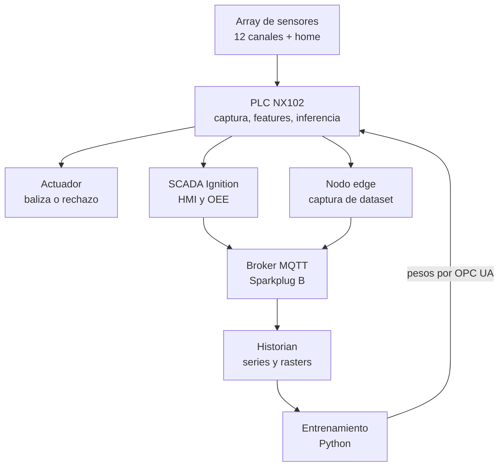
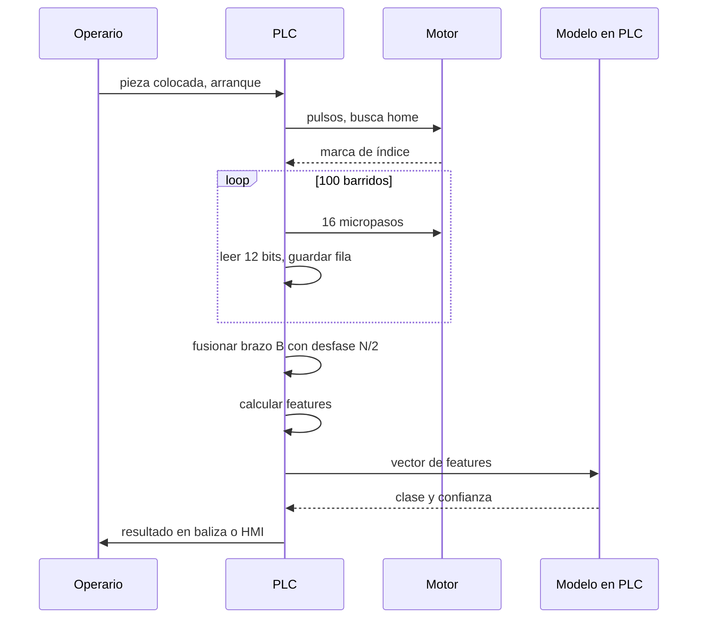
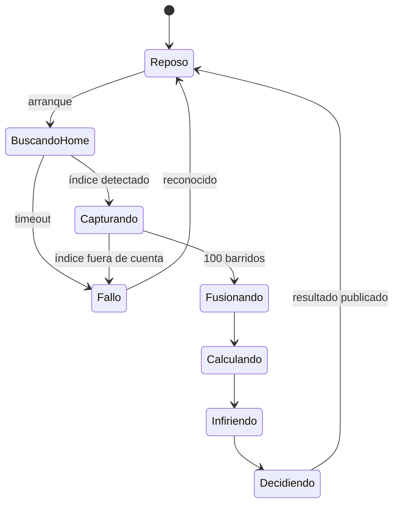
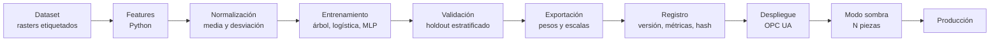

# 01 — Arquitectura

> Categoría Diátaxis: **Explicación**. Responde *por qué está hecho así*.
> Fuente: `docs/00-brief.md` §4. Los diagramas son normativos; el texto explicativo
> se completa con los `TODO`.

## 1. Capas del sistema

La decisión rápida nunca sale del PLC. Si el enlace al edge se cae, la máquina sigue
clasificando y actuando.

<!-- TODO: desarrollar por qué la decisión vive en el PLC y no en el edge/PC.
     Argumento: latencia determinista, disponibilidad sin red, ciclo de scan acotado.
     Referir a docs/02-matematicas.md §5.11 para el costo computacional. -->

## 2. Ciclo de una pieza

<!-- TODO: detallar el tiempo de cada etapa (peor caso) y de dónde sale cada número. -->

## 3. Máquina de estados del ciclo

<!-- TODO: listar cada transición, su condición exacta y el temporizador asociado.
     El timeout de búsqueda de home está PENDIENTE (no está en el brief). -->

## 4. Pipeline del modelo

<!-- TODO: describir el contrato entre cada etapa y el layout del UDT de pesos.
     Ver docs/03-contrato-datos.md. -->

## 5. Decisiones y su razonamiento

- **Por qué el PLC y no una PC:** <!-- TODO -->
- **Por qué Sparkplug B y no MQTT plano:** <!-- TODO -->
- **Por qué brazos a 180°:** ver `docs/adr/0002-viga-diametral-180.md`.
- **Por qué PLC Omron como plataforma de captura:** ver `docs/adr/0001-plc-de-captura.md`.
- **Por qué un feature no invariante a reflexión:** ver `docs/02-matematicas.md` §5.6.

## 6. Conexiones

- Conexiones eléctricas: `hardware/cableado/`.
- Contrato de datos (OPC UA, Sparkplug, UDT de pesos): `docs/03-contrato-datos.md`.
- Tipos compartidos entre plataformas: `plc/shared/contratos.md`.
