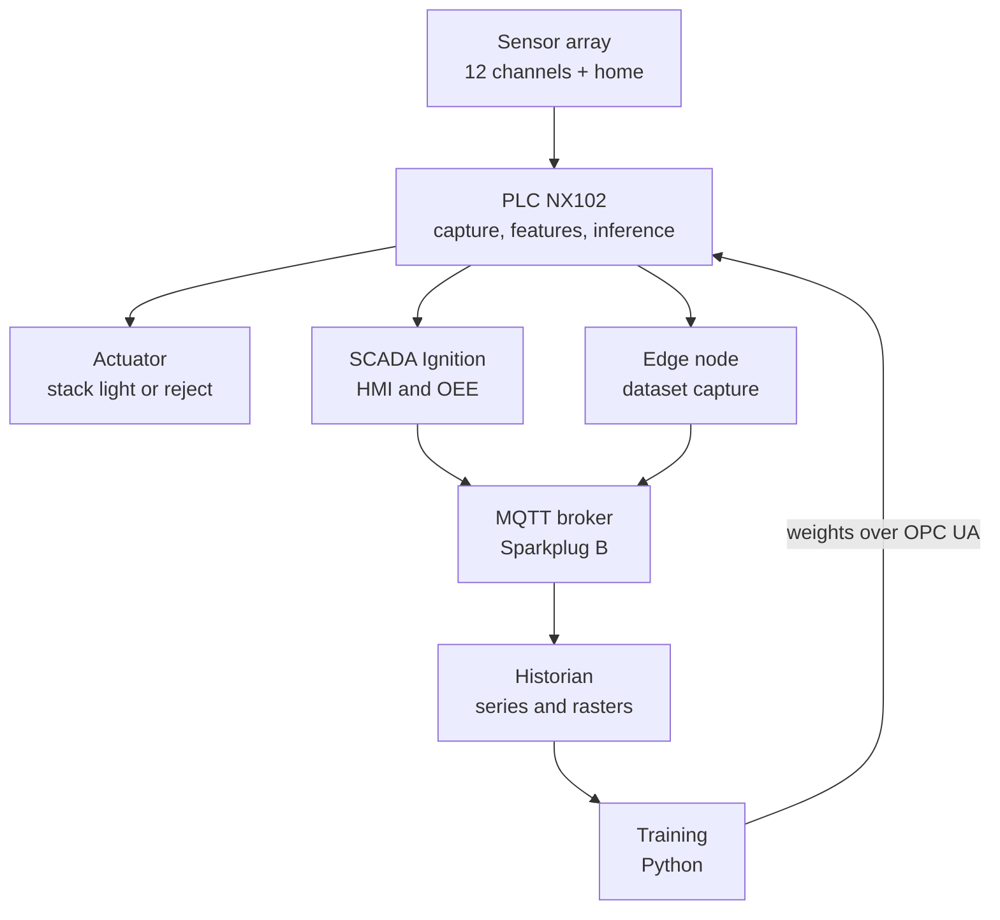
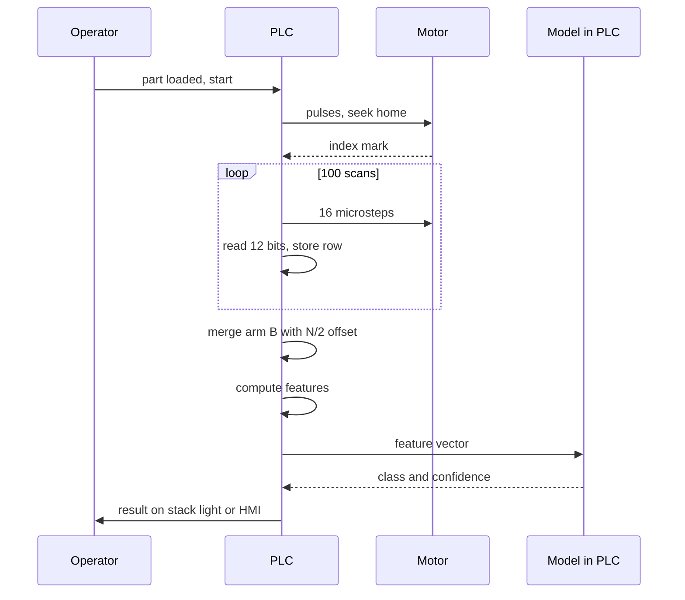
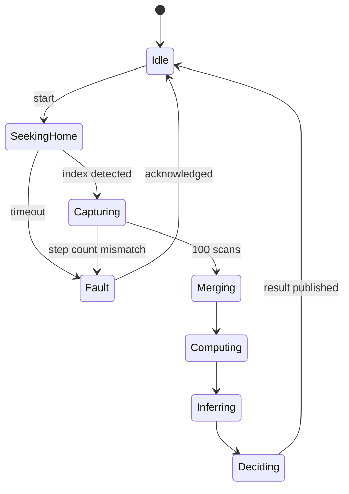
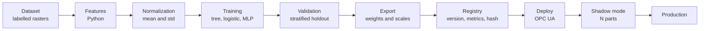
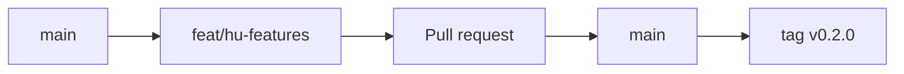

# Project Girasol — Bootstrap Brief

> **Master context document.** Paste this in full as the first message of a Kilo Code
> project, or save it to `docs/00-brief.md` and reference it from the repo rules.
> Everything an agent needs to work in this repository is here.

---

## 0. Instructions for the agent

You are a development agent working on **Girasol**. Before writing a single line of
code:

1. Read this document in full.
2. Create the folder structure from section 6, with placeholder files.
3. Initialize the git repository per section 8.
4. Generate the `docs/` files per section 10.
5. Open the issues from section 11.

**Non-negotiable rules:**

- No code without its test. Geometric features are validated against golden vectors
  before being ported to Structured Text.
- Any computation implemented twice (Python and ST) must produce identical results
  within a declared tolerance. This is verified automatically in CI.
- Datasets never enter the repository. Only their schema and checksum.
- Every non-obvious architectural decision is recorded as an ADR.
- Documentation is written in English.
- Commits follow Conventional Commits. No exceptions.

---

## 1. What Girasol is

A **camera-free industrial vision system**. A rotating table carries a part under a
row of discrete photoelectric sensors. The PLC accumulates the binary readings into a
matrix representing the part's silhouette, computes geometric descriptors, and runs a
machine learning classifier **inside the PLC itself** to decide which part it is and
whether it is correctly oriented.

Model weights are trained in Python and deployed to the PLC over OPC UA, with shadow
validation before the new model takes control.

### Why it exists

This is not a part-detection project. It is a demonstration of five competencies:

| Competency | Where it shows |
| --- | --- |
| Structured PLC programming | Synchronous capture, circular buffer, state machine, pulse generation |
| Hand-implemented algorithms | Image moments in ST, no libraries |
| ML from the inside | Inference reimplemented in ST: matrix-vector product, activation, argmax |
| Unconventional use of a PLC | ML inference at cycle time — no PC, no cloud, no camera |
| MLOps grounded in plant reality | Capture, train, version, deploy over OPC UA, validate in shadow mode |

### What it is not

- Not a safety system. No sensor here is a safety component.
- Not an attempt to match an industrial camera on resolution.
- Not deep learning. The model fits inside a PLC on purpose.

---

## 2. Glossary

| Term | Definition |
| --- | --- |
| **Scan** / row | One simultaneous reading of the M channels. An M-bit vector. |
| **Raster** | Matrix of N scans × M channels accumulated over one full revolution. |
| **Channel** | One sensor. Numbered 0 (smallest radius) to M−1 (largest). |
| **Arm A / arm B** | The two halves of the diametral beam. A carries even channels, B odd. |
| **Index / home** | Dedicated sensor reading a mark on the table edge, once per revolution. |
| **Feature** | Numeric descriptor computed from the raster (area, centroid, moment…). |
| **Golden vector** | An (input raster, expected output) pair used to validate ST against Python. |
| **Shadow mode** | The new model infers in parallel without acting, purely for comparison. |
| **BGS** | Background suppression via triangulation. |

---

## 3. Hardware

| Item | Specification | Qty |
| --- | --- | --- |
| Photoelectric sensor | Balluff BOS ...-PU-RH10-S75, diffuse with BGS, PNP NO/NC, M8 4-pin, 10–30 VDC | 17 on hand |
| Radial channels | 12 in use (6 per arm) | 12 |
| Home index | 1 sensor aimed at the table edge | 1 |
| Spares | Unmounted | 4 |
| Primary PLC | Omron NX102-9000 | 1 |
| Digital inputs | 2 × NX-ID5442 (32 points) | 2 |
| Digital outputs | NX-OD5256 | 1 |
| Secondary PLC (portability) | Allen-Bradley CompactLogix L33ER | 1 |
| Motor | NEMA 17 | 1 |
| Driver | TB6600, 24 V logic inputs, common cathode | 1 |
| Power supply | 24 VDC, 3 A minimum | 1 |
| Cordsets | M8 female 4-pin | 13 |

### Array geometry

- Straight diametral beam on two posts (gantry, not cantilever).
- Arm A radii: 30, 50, 70, 90, 110, 130 mm.
- Arm B radii: 40, 60, 80, 100, 120, 140 mm.
- Pitch between neighbours on the same arm: 20 mm.
- Combined radial resolution: 10 mm.
- Angular offset between arms: 180°, i.e. exactly N/2 scans.
- Body orientation: long axis (43 mm) **tangential**, short axis (11 mm) radial.
- Working distance: 50–80 mm from optical face to table.
- Radius is measured from the rotation axis to the light spot, horizontally.

### Motion parameters

| Parameter | Value | Symbol |
| --- | --- | --- |
| Microsteps per revolution | 1600 (1/8 step, 200 full steps) | $S$ |
| Microsteps per scan | 16 | $s$ |
| Scans per revolution | 100 | $N$ |
| Angular resolution | 3.6° | $\Delta\theta$ |
| Pulse period | 2 ms | $T_p$ |
| Revolution time | 3.2 s | $T_{rev}$ |
| Channels | 12 | $M$ |

---

## 4. Architecture

### 4.1 System layers



The fast decision never leaves the PLC. If the edge link drops, the machine keeps
classifying and acting. That design rule is what separates this project from a
desktop demo.

### 4.2 One part cycle



### 4.3 Cycle state machine



### 4.4 Model pipeline



---

## 5. Mathematics

This section is the normative reference. Python and ST must implement exactly these
formulas.

### 5.1 The polar raster

Each raster cell corresponds to an angular position and a radius:

$$\theta_k = \frac{2\pi k}{N}, \quad k = 0,\dots,N-1$$

$$r_j \in \{30, 40, 50, \dots, 140\}\ \text{mm}, \quad j = 0,\dots,M-1$$

The raw raster is $B_{\text{raw}}[k][j] \in \{0,1\}$.

### 5.2 Merging the two arms

Arm B is half a revolution out of phase. Odd channels are corrected:

$$B[k][j] = \begin{cases}
B_{\text{raw}}[k][j] & j \text{ even (arm A)} \\
B_{\text{raw}}\left[\left(k + \tfrac{N}{2}\right) \bmod N\right][j] & j \text{ odd (arm B)}
\end{cases}$$

With $N = 100$ the offset is exactly 50 rows. This is why $N$ must be even.

### 5.3 Area weighting in polar coordinates

**This is the easiest mistake to make.** In polar coordinates the outer cells cover
more physical area than the inner ones. A plain bit count overestimates parts sitting
near the centre.

The differential area is $dA = r\, dr\, d\theta$, so each cell is weighted
proportionally to its radius:

$$w_j = r_j$$

### 5.4 Moments

Raw moments, with the area correction applied:

$$M_{00} = \sum_{k}\sum_{j} B[k][j]\, r_j$$

Converting to Cartesian, with $x_{kj} = r_j\cos\theta_k$ and $y_{kj} = r_j\sin\theta_k$:

$$M_{10} = \sum_{k}\sum_{j} B[k][j]\, r_j\, x_{kj}, \qquad
M_{01} = \sum_{k}\sum_{j} B[k][j]\, r_j\, y_{kj}$$

Centroid:

$$\bar{x} = \frac{M_{10}}{M_{00}}, \qquad \bar{y} = \frac{M_{01}}{M_{00}}$$

Second-order central moments:

$$\mu_{20} = \sum_{k,j} B\, r_j (x_{kj}-\bar{x})^2, \quad
\mu_{02} = \sum_{k,j} B\, r_j (y_{kj}-\bar{y})^2, \quad
\mu_{11} = \sum_{k,j} B\, r_j (x_{kj}-\bar{x})(y_{kj}-\bar{y})$$

Approximate physical area:

$$A \approx M_{00} \cdot \Delta r \cdot \Delta\theta$$

### 5.5 Orientation and elongation

$$\phi = \frac{1}{2}\arctan_2\left(2\mu_{11},\ \mu_{20}-\mu_{02}\right)$$

The eigenvalues of the covariance matrix give the semi-axes:

$$\lambda_{1,2} = \frac{\mu_{20}+\mu_{02}}{2} \pm \frac{\sqrt{4\mu_{11}^2 + (\mu_{20}-\mu_{02})^2}}{2}$$

$$\text{elongation} = \sqrt{\lambda_1/\lambda_2}, \qquad
\text{eccentricity} = \sqrt{1 - \lambda_2/\lambda_1}$$

### 5.6 Invariance — why it matters here

The part is placed on the table **at an arbitrary position and an arbitrary angle**.
The raster's angular origin is fixed by the home mark, not by the part. Therefore the
features fed to the classifier must be invariant to translation and rotation, or the
model will learn *where you put the part* instead of *what the part is*.

Normalized central moments:

$$\eta_{pq} = \frac{\mu_{pq}}{\mu_{00}^{\,1+\frac{p+q}{2}}}$$

The first two Hu invariants:

$$\varphi_1 = \eta_{20} + \eta_{02}$$

$$\varphi_2 = (\eta_{20}-\eta_{02})^2 + 4\eta_{11}^2$$

**Deliberate exception:** detecting a flipped part requires a feature that is *not*
invariant to reflection. Hu's $\varphi_7$ changes sign under reflection and is exactly
that. Document it as a design decision.

### 5.7 Feature vector

| # | Feature | Invariant to |
| --- | --- | --- |
| 0 | $A$ — physical area | translation, rotation |
| 1 | $\varphi_1$ | translation, rotation, scale |
| 2 | $\varphi_2$ | translation, rotation, scale |
| 3 | $\varphi_7$ (signed) | translation, rotation — **not** reflection |
| 4 | elongation | translation, rotation |
| 5 | $\rho_{\max} - \rho_{\min}$ — occupied annulus width | rotation only |
| 6 | mean transitions per row | translation, rotation |
| 7 | compactness $P^2/A$ | translation, rotation, scale |
| 8 | fraction of occupied rows | translation, rotation |
| 9 | $\lambda_1/\lambda_2$ | translation, rotation, scale |

Ten features. The engineering lesson of the project: with a cheap sensor, good
feature engineering beats a big model.

### 5.8 Normalization

Parameters are computed on the training set and travel with the weights:

$$\hat{x}_i = \frac{x_i - \mu_i}{\sigma_i + \epsilon}, \qquad \epsilon = 10^{-8}$$

If $\mu$ and $\sigma$ are not deployed alongside the weights, the model in the PLC
outputs garbage. They live in the same UDT, versioned together.

### 5.9 The three models

**Decision tree.** Compiles to nested IF/THEN. Zero multiplications, deterministic,
auditable. This is the explainable-AI-in-control argument.

**Multiclass logistic regression.**

$$z = W\hat{x} + b, \qquad W \in \mathbb{R}^{K \times 10}$$

**MLP 10-12-K.**

$$h = \tanh(W_1\hat{x} + b_1), \qquad z = W_2 h + b_2$$

In all three cases the decision is $\hat{y} = \arg\max_c z_c$.

**Implementation note:** softmax is not computed in the PLC for the decision, because
it is monotonic and does not change the argmax. It is computed only when a probability
is needed for the reject option:

$$p_c = \frac{e^{z_c - \max_i z_i}}{\sum_i e^{z_i - \max_i z_i}}$$

Subtracting the maximum prevents overflow in `REAL`. Do not omit it.

### 5.10 Reject option via conformal prediction

Over a calibration set of $n$ samples, compute the nonconformity score:

$$s_i = 1 - p_{y_i}^{(i)}$$

The threshold is the empirical quantile:

$$\hat{q} = \text{Quantile}_{\lceil (n+1)(1-\alpha)\rceil / n}\left(\{s_i\}\right)$$

The prediction set is $\Gamma(x) = \{c : 1 - p_c \le \hat{q}\}$. If
$|\Gamma(x)| \neq 1$, the part goes to manual inspection instead of being guessed.

Guarantee: $P(y \in \Gamma(x)) \ge 1-\alpha$.

### 5.11 Computational cost

| Model | Multiplications | Memory (REAL) |
| --- | --- | --- |
| Tree, depth 5 | 0 | ~32 |
| Logistic, K=4 | 40 | 44 |
| MLP 10-12-4 | 168 | 184 |

Plus roughly 1200 operations for the moments over the raster. All of it fits
comfortably in an NX102 periodic task — and measuring that is one of the deliverables.

---

## 6. Repository structure

```
girasol/
├── README.md                    # portfolio front page
├── LICENSE                      # MIT
├── CHANGELOG.md                 # Keep a Changelog
├── CONTRIBUTING.md
├── CODE_OF_CONDUCT.md
├── .gitignore
├── .gitattributes               # git-lfs for STL and binaries
├── .editorconfig
├── .pre-commit-config.yaml
│
├── .github/
│   ├── workflows/
│   │   ├── ci.yml               # lint, test, coverage
│   │   ├── docs.yml             # documentation build
│   │   └── parity.yml           # ST vs Python on golden vectors
│   ├── ISSUE_TEMPLATE/
│   │   ├── bug.yml
│   │   ├── feature.yml
│   │   └── experiment.yml
│   └── pull_request_template.md
│
├── .kilocode/
│   ├── rules/
│   │   ├── 01-context.md
│   │   ├── 02-style.md
│   │   ├── 03-st-constraints.md
│   │   └── 04-git.md
│   └── modes/
│       └── custom-modes.yaml
│
├── docs/
│   ├── 00-brief.md              # this document
│   ├── 01-architecture.md
│   ├── 02-mathematics.md
│   ├── 03-data-contract.md      # OPC UA tags, MQTT payload, weights UDT
│   ├── 04-assembly-manual.md
│   ├── 05-operation-manual.md
│   ├── 06-training-manual.md
│   ├── 07-plain-language.md
│   ├── adr/
│   │   ├── 0001-capture-plc.md
│   │   ├── 0002-diametral-beam-180.md
│   │   └── template.md
│   └── diagrams/
│
├── hardware/
│   ├── cad/                     # parametric sources
│   ├── stl/                     # git-lfs
│   ├── bom.csv
│   ├── wiring/
│   └── jig/
│
├── plc/
│   ├── omron-nx102/
│   │   ├── src/                 # ST exported as text, diffable
│   │   │   ├── POU_Capture.st
│   │   │   ├── POU_Merge.st
│   │   │   ├── POU_Features.st
│   │   │   ├── POU_Inference.st
│   │   │   └── POU_Shadow.st
│   │   ├── udt/
│   │   └── README.md            # how to import into Sysmac
│   ├── ab-l33er/
│   │   ├── src/                 # exported L5X
│   │   └── README.md
│   └── shared/
│       └── contracts.md         # types common to both platforms
│
├── ml/
│   ├── pyproject.toml
│   ├── src/girasol/
│   │   ├── __init__.py
│   │   ├── raster.py            # loading, arm merging
│   │   ├── features.py          # section 5, reference implementation
│   │   ├── models/
│   │   │   ├── tree.py
│   │   │   ├── logistic.py
│   │   │   └── mlp.py
│   │   ├── export.py            # weights to JSON and to ST
│   │   ├── conformal.py
│   │   ├── synth.py             # STL rasterizer
│   │   └── cli.py
│   ├── tests/
│   │   ├── test_features.py
│   │   ├── test_parity.py
│   │   └── golden/              # golden vectors
│   ├── configs/
│   └── notebooks/               # exploration, not production
│
├── edge/
│   ├── collector/               # OPC UA subscriber to Parquet
│   └── bridge/                  # Sparkplug B publisher
│
├── scada/
│   └── ignition/                # project export
│
├── data/
│   └── README.md                # schema and checksums; data lives outside the repo
│
└── models/
    └── registry.json            # version, metrics, hash, date
```

### Structure rules

- `notebooks/` is a lab notebook, not production. Nothing imports from it.
- `ml/src/girasol/features.py` is **the reference implementation**. ST is validated
  against it, never the other way around.
- `plc/*/src/` holds code exported as plain text. Binary project files (`.smc2`,
  `.ACD`) go through git-lfs and are not diffed.
- `data/` contains no data. It contains how to obtain it and how to verify it.

---

## 7. Coding conventions

### Python

- Formatting: `ruff format`. Linting: `ruff check`. Types: `mypy --strict` on `src/`.
- NumPy-style docstrings referencing the corresponding formula in section 5.
- No magic numbers: every geometric or capture parameter lives in `configs/`.
- `pytest` with `--cov`, minimum 85 % on `features.py`.
- Fixed seeds anywhere randomness is involved.

### Structured Text

- One POU per responsibility. No 800-line blocks.
- Names in English, comments explaining *why* rather than *what*.
- Type prefixes: `b` boolean, `i` integer, `r` real, `a` array, `s` string.
- No unbounded `WHILE`. No recursion. No dynamic allocation.
- Constants in exactly one place, in a configuration UDT.
- Every POU implementing something from section 5 carries the exact reference in its
  header: `-- See docs/02-mathematics.md section 5.4`.

### Commits

Conventional Commits with a mandatory scope:

```
<type>(<scope>): <imperative description>

[optional body]

[optional footer: Closes #12]
```

Types: `feat`, `fix`, `docs`, `test`, `refactor`, `perf`, `build`, `ci`, `chore`, `exp`.

Scopes: `plc`, `ml`, `edge`, `scada`, `hw`, `docs`, `repo`.

Examples:

```
feat(ml): implement Hu moments with polar area correction
fix(plc): correct arm B offset when N is odd
exp(ml): compare MLP 10-12-4 against logistic on dataset v3
docs(hw): add mounting jig dimensions
```

The `exp` type is specific to this project: it marks an experiment whose result is
recorded but whose code may not survive.

---

## 8. Git and GitHub

### 8.1 Initialization

```bash
git init
git branch -M main
git remote add origin git@github.com:nonames-bit/girasol.git

git lfs install
git lfs track "*.stl" "*.step" "*.smc2" "*.ACD" "*.png" "*.mp4"
git add .gitattributes

git add .
git commit -m "chore(repo): initial project structure"
git push -u origin main
```

### 8.2 Branching model

Trunk-based with short-lived branches. `main` is always deployable.



| Prefix | Use | Lifetime |
| --- | --- | --- |
| `feat/` | new functionality | days |
| `fix/` | correction | hours |
| `docs/` | documentation only | hours |
| `exp/` | experiment, may die | as long as it takes |
| `hw/` | mechanical and CAD | days |

Never commit directly to `main`. Always open a pull request, even working solo — the
PR is where *why* gets written down, and that is what a recruiter reads.

### 8.3 Branch protection

Under Settings → Branches:

- Require a pull request before merging.
- Require CI to pass.
- Squash merge only. Linear, readable history.
- Delete branch on merge.

### 8.4 Labels

| Label | Colour | Use |
| --- | --- | --- |
| `phase-1` … `phase-5` | blue | roadmap stage |
| `area:plc` | orange | PLC code |
| `area:ml` | purple | Python and models |
| `area:hw` | grey | mechanical and electrical |
| `area:docs` | green | documentation |
| `type:bug` | red | defect |
| `type:experiment` | yellow | uncertain outcome |
| `blocked` | black | waiting on something external |
| `good-first-agent-task` | light blue | scoped, ideal to delegate to an agent |

### 8.5 Milestones

One milestone per phase. Closing a milestone triggers a tag:

| Milestone | Tag | Exit criterion |
| --- | --- | --- |
| Phase 1 — Capture | `v0.1.0` | Raster of a part visible in Python |
| Phase 2 — Classifier | `v0.2.0` | Inference running on the NX102, video recorded |
| Phase 3 — SCADA and IoT | `v0.3.0` | Tags published, HMI operational |
| Phase 4 — MLOps | `v0.4.0` | Weights deployed over OPC UA with shadow mode |
| Phase 5 — Extensions | `v1.0.0` | Allen-Bradley portability measured and documented |

Semantic versioning. `CHANGELOG.md` in Keep a Changelog format, updated in the same
PR that introduces the change.

### 8.6 Continuous integration

`.github/workflows/ci.yml` runs on every PR:

1. `ruff check` and `ruff format --check`
2. `mypy --strict src/`
3. `pytest --cov --cov-fail-under=85`
4. Verify `CHANGELOG.md` changed if `src/` changed

`.github/workflows/parity.yml` runs when `plc/` or `features.py` changes:

1. Run the golden vectors against the Python implementation.
2. Compare against reference ST outputs stored in `tests/golden/st/`.
3. Fail if relative difference exceeds $10^{-4}$.

This workflow is what makes the project look serious. Nobody expects CI on an
automation project.

### 8.7 `.gitignore`

```gitignore
__pycache__/
*.py[cod]
.venv/
.mypy_cache/
.pytest_cache/
.ruff_cache/
htmlcov/
.coverage

data/raw/
data/processed/
*.parquet
*.csv.gz

models/*.onnx
models/checkpoints/

.vscode/
.idea/
.DS_Store

*.bak
Backup*/
```

---

## 9. Working with agents in Kilo Code

### 9.1 Principle

An agent is not a junior developer you hand a topic to. It is a very fast executor of
**scoped, verifiable tasks**. Output quality depends almost entirely on how well the
acceptance criterion is defined.

Rule: **if you cannot write the test first, the task is not ready to delegate.**

### 9.2 Modes

| Mode | When | What it must NOT do |
| --- | --- | --- |
| **Architect** | Design structure, ADRs, data contracts | Write implementation |
| **Code** | Implement against an existing specification | Decide architecture on its own |
| **Debug** | Reproduce and isolate a failure | Change the design to dodge the bug |
| **Ask** | Explain code or concepts | Modify files |
| **Orchestrator** | Split an epic into subtasks and dispatch them | Implement directly |

### 9.3 Project-specific custom modes

Define in `.kilocode/modes/custom-modes.yaml`:

**`plc-st`** — Writes IEC 61131-3 Structured Text only. Hard constraints: no
recursion, no dynamic memory, no unbounded loops, no blocking calls. Every POU
declares its worst-case execution time in its header. May only edit `plc/**`.

**`ml-py`** — Python for features, training and export. Required to maintain numerical
parity with `plc/omron-nx102/src/POU_Features.st`. May only edit `ml/**`.

**`parity`** — Implements nothing. Takes the golden vectors, runs both implementations
and reports differences. May only edit `ml/tests/**`.

**`docs-en`** — Writes technical documentation, diagrams in Mermaid. Forbidden from
inventing figures: if a number is not in the code or in this brief, it is flagged as
pending. May only edit `docs/**` and `README.md`.

### 9.4 Repository rules

`.kilocode/rules/01-context.md` must contain sections 1, 2 and 3 of this brief.
Agents read it automatically and stop inventing context.

`.kilocode/rules/03-st-constraints.md` contains the ST constraints from section 7.
Without it, an agent will write unbounded `WHILE` loops and pointers.

### 9.5 How to split the work

A pattern that works, applied to any feature:

1. **Architect** writes the specification in `docs/` with the formula and the
   acceptance criterion. Commit `docs(ml): specify Hu moments`.
2. **ml-py** writes the test first with golden vectors, failing.
   Commit `test(ml): golden vectors for Hu moments`.
3. **ml-py** implements until the test passes.
   Commit `feat(ml): implement Hu moments`.
4. **plc-st** ports to ST from the same specification, **without reading the Python**.
   Commit `feat(plc): port Hu moments to ST`.
5. **parity** verifies both agree.
   Commit `test(repo): verify Hu moment parity`.

Step 4 not reading the Python is deliberate. If both come from the same document and
agree, the document is well written. If they diverge, the document is ambiguous. This
is independent implementation verification — the technique used in safety-critical
software.

### 9.6 Antipatterns

- Asking for "implement phase 2". Too large; the agent will invent.
- Letting the agent choose the algorithm. That is a design decision and needs an ADR.
- Accepting code without running the test. Agents can write always-passing tests.
- Giving it access to `data/` or credentials.
- Letting it "fix" a failing test by loosening the tolerance.

---

## 10. Documentation

### 10.1 Diátaxis model

Every document belongs to exactly one of four categories. Mixing them is the number
one cause of useless documentation.

| Category | Question it answers | Files |
| --- | --- | --- |
| **Tutorial** | How do I learn this from zero? | `04-assembly-manual.md` |
| **How-to** | How do I perform a specific task? | `06-training-manual.md` |
| **Reference** | What is the exact value of X? | `02-mathematics.md`, `03-data-contract.md` |
| **Explanation** | Why is it built this way? | `01-architecture.md`, `adr/` |

### 10.2 Required documents

**`README.md`**. A photo of the rig, three sentences on what it does, the stack, a
10-second GIF of the system classifying, and links to the docs. It is the only thing
a recruiter will read. Make it count.

**`docs/01-architecture.md`**. The diagrams from section 4 plus the reasoning: why the
decision lives in the PLC, why Sparkplug instead of plain MQTT, why 180°.

**`docs/02-mathematics.md`**. Section 5 in full — the normative reference the code is
validated against.

**`docs/03-data-contract.md`**. Table of OPC UA tags with type and unit, Sparkplug
payload schema, and the exact weights UDT layout. Without this document, Python and
the PLC drift apart within a week.

**`docs/04-assembly-manual.md`**. Step by step with photos: print, mount the beam,
position with the jig, wire the TB6600, teach the sensors. Written so someone else can
reproduce it.

**`docs/05-operation-manual.md`**. Start up, capture a dataset, read the stack light,
what to do for each fault.

**`docs/06-training-manual.md`**. From dataset to deployed weights, with exact commands.

**`docs/07-plain-language.md`**. For a non-engineer. No formulas.

### 10.3 ADRs

Short format, one file per decision, numbered and never deleted — if a decision is
reversed, a new ADR supersedes the old one.

```markdown
# ADR-0002 — Diametral beam with arms at 180°

- Status: accepted
- Date: 2026-09-19

## Context
The sensors must cover the radius with fine resolution, but the body measures 43 mm
tangentially and they cannot sit adjacent.

## Options considered
1. Single radial row, 14 mm pitch. Requires a 500 mm table, not printable.
2. Two parallel rows 25 mm apart. The angular offset then depends on radius, forcing
   per-channel correction.
3. Diametral beam, arms at 180°, interleaved radii.

## Decision
Option 3.

## Consequences
- The offset is constant: exactly N/2 scans. Requires N to be even.
- Capture needs one and a half revolutions of data before merging.
- Gantry structure, no cantilever deflection.
- No sensor sits closer than 20 mm to another.
```

### 10.4 Experiment log

`docs/experiments/YYYY-MM-DD-slug.md`, one per experiment, with hypothesis, setup,
result and conclusion. Include the ones that failed — in a portfolio, a well-documented
failed experiment is worth more than three successes with no method.

---

## 11. Roadmap and issues

Create one epic issue per phase and break it down. All with milestone and labels.

### Phase 1 — Mechanics and capture (`v0.1.0`)

- [ ] `hw`: design 310 mm table in printable segments
- [ ] `hw`: design sensor clip with height stop registering against the extrusion
- [ ] `hw`: design mounting jig with centring hole for the shaft
- [ ] `hw`: verify optical crosstalk with two sensors at 20 mm
- [ ] `plc`: pulse generation for the TB6600 from a periodic task
- [ ] `plc`: home mark detection and step-count verification
- [ ] `plc`: circular raster buffer, `ARRAY[0..99, 0..11] OF BOOL`
- [ ] `plc`: raster dump over OPC UA
- [ ] `ml`: raster loading and visualization as an image
- [ ] `docs`: assembly manual with photos
- [ ] `docs`: ADR-0002 diametral beam

### Phase 2 — Classifier in the PLC (`v0.2.0`)

- [ ] `hw`: design and print 4 part classes plus one flipped variant
- [ ] `ml`: capture 40 revolutions per class, varying position
- [ ] `ml`: implement arm merging (section 5.2)
- [ ] `ml`: implement features with polar correction (sections 5.3–5.7)
- [ ] `ml`: generate golden vectors
- [ ] `ml`: train tree, logistic and MLP; compare
- [ ] `ml`: weight exporter to JSON and to ST constants
- [ ] `plc`: port features to ST
- [ ] `plc`: port inference to ST
- [ ] `repo`: parity workflow in CI
- [ ] `plc`: stack light output by class
- [ ] `docs`: record 40-second video

### Phase 3 — SCADA and IoT (`v0.3.0`)

- [ ] `plc`: expose OPC UA tags per the data contract
- [ ] `scada`: operator screen in Perspective
- [ ] `scada`: OEE and reject rate calculation
- [ ] `edge`: OPC UA collector to Parquet
- [ ] `edge`: Sparkplug B publisher
- [ ] `edge`: historian and dashboard
- [ ] `docs`: complete data contract

### Phase 4 — MLOps (`v0.4.0`)

- [ ] `plc`: versioned weights UDT with A/B bank
- [ ] `ml`: weight write over OPC UA
- [ ] `plc`: shadow mode, comparison over N parts
- [ ] `plc`: switchover and result reporting
- [ ] `ml`: model registry with metrics and hash
- [ ] `ml`: conformal prediction and reject option
- [ ] `docs`: training and deployment manual

### Phase 5 — Extensions (`v1.0.0`)

- [ ] `plc`: port inference to the L33ER
- [ ] `repo`: measure scan time and memory on both platforms
- [ ] `ml`: synthetic rasterizer from STL
- [ ] `ml`: accuracy vs number of real samples curves
- [ ] `ml`: autoencoder for profile anomaly detection
- [ ] `ml`: array self-diagnosis via neighbour correlation
- [ ] `docs`: comparative report, Omron vs Allen-Bradley

---

## 12. Definition of Done

A task is done when **all** of these hold:

- [ ] Code passes lint, types and tests in CI.
- [ ] If it touches a computation from section 5, the ST/Python parity test passes.
- [ ] Affected documentation is updated in the same PR.
- [ ] `CHANGELOG.md` has its entry.
- [ ] If it was a design decision, an ADR exists.
- [ ] The PR explains *why*, not just *what*.
- [ ] If it is hardware, there is a photo of the assembly in `docs/`.

---

## 13. First prompt for Kilo Code

Paste this after the brief:

```
Work in Architect mode.

Task: create the complete repository scaffolding for Girasol per section 6 of
this brief.

Deliverables:
1. All folders, with .gitkeep where empty.
2. README.md following the structure in 10.2, marking with TODO whatever does
   not exist yet.
3. .gitignore, .gitattributes with the git-lfs rules, .editorconfig,
   .pre-commit-config.yaml with ruff and mypy.
4. ml/pyproject.toml with ruff, strict mypy, pytest and 85 % minimum coverage.
5. The three workflows under .github/workflows/ per section 8.6.
6. Issue and pull request templates.
7. The four files under .kilocode/rules/, populated from this brief.
8. .kilocode/modes/custom-modes.yaml with the four modes from section 9.3.
9. docs/ with the files from 10.2 — headings only, one TODO per section.
10. docs/adr/template.md plus ADR-0001 and ADR-0002.
11. CHANGELOG.md with an Unreleased section.

Constraints:
- Do not implement logic yet. Scaffolding only.
- Do not invent numeric values. The ones you need are in sections 3 and 5.
- One commit per logical group, in Conventional Commits format.

When you are done, show me the resulting tree and tell me which decisions you
made that were not specified in the brief.
```

That last question is the important one. It is where you find out whether the agent
understood, or filled gaps on its own.
