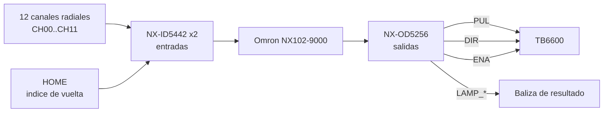

# Esquema de control

> Señales de mando entre el PLC, el driver del motor, el sensor de home y la baliza.
> Datos ciertos: `docs/00-brief.md` §3 y §4.3. Lo no especificado va como **`PENDIENTE`**.

## 1. Diagrama

## 2. Datos confirmados

| Señal | Dirección | Descripción |
| --- | --- | --- |
| CH00…CH11 | Entrada | 12 canales radiales, PNP 24 VDC |
| HOME | Entrada | Índice una vez por vuelta |
| PUL | Salida | 16 micropasos por barrido, período de pulso 2 ms |
| DIR | Salida | Sentido de giro |
| ENA | Salida | Habilitación del driver, 24 V cátodo común |
| LAMP_* | Salida | Resultado de la clasificación |

Máquina de estados del ciclo: `docs/01-arquitectura.md` §3.

## 3. Pendientes

- Punto exacto de cada señal en los módulos NX: **`PENDIENTE`** (ver `mapeo-io.md`).
- ¿Se usa `ENA` o el driver queda siempre habilitado? **`PENDIENTE`**.
- Polaridad lógica de PUL/DIR/ENA con cátodo común y su relación con PNP/NPN:
  **`PENDIENTE`**. El brief solo dice "24 V, cátodo común".
- Número de indicadores de la baliza y mapeo clase → color: **`PENDIENTE`**.
- Tiempo máximo de la búsqueda de home (timeout del estado `BuscandoHome`):
  **`PENDIENTE`**.

## 4. Aislamiento y ruido

- Los pulsos de paso a 2 ms de período conviven con señales de sensor en el mismo
  gabinete. Apantallado y referencias de tierra: **`PENDIENTE`**.
- Longitud máxima de los cordsets M8 hasta el gabinete: **`PENDIENTE`**.

<!-- TODO: sustituir este boceto por el esquema eléctrico formal del taller. -->
