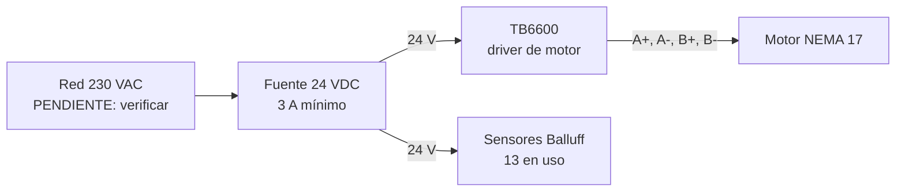

# Esquema de potencia

> Alimentación del driver de motor, del motor y de los sensores.
> Datos ciertos: `docs/00-brief.md` §3. Lo no especificado va como **`PENDIENTE`**.

## 1. Diagrama

## 2. Datos confirmados

| Elemento | Especificación (brief §3) |
| --- | --- |
| Fuente | 24 VDC, 3 A mínimo |
| Driver | TB6600, entradas de 24 V, cátodo común |
| Motor | NEMA 17 |
| Sensores | 10–30 VDC, M8 4 pines |

## 3. Pendientes

- Protección de entrada (fusible / breaker): valor y curva **`PENDIENTE`**.
- Sección de conductor para motor y para sensores: **`PENDIENTE`**.
- ¿La fuente alimenta también los sensores, o hay una fuente separada? **`PENDIENTE`**.
- Terminales físicos de la fuente y del TB6600: **`PENDIENTE`** (requiere datasheet).
- Refrigeración / ventilación del driver: **`PENDIENTE`**.

## 4. Notas de seguridad

- Ningún sensor es componente de seguridad.
- El lazo de parada de emergencia, si existe, es **`PENDIENTE`** y no está contemplado
  por el brief.

<!-- TODO: sustituir este boceto por un esquema eléctrico formal una vez definidos los
     componentes exactos. Este archivo referencia, no duplica, el esquema del taller. -->
